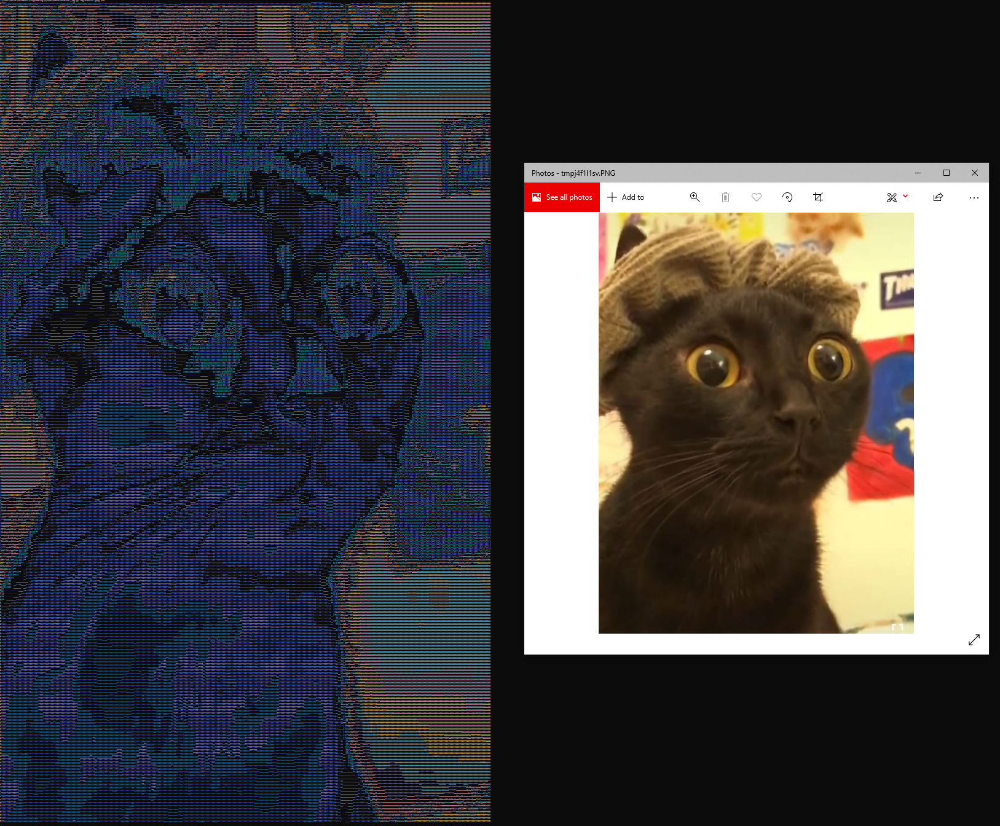

# Image to ASCII 'Converter'

## Description

This is a small Python script that I made when I was bored which takes a photo and prints it in the terminal with ASCII characters only like shown:

## Features

You can call the script as shown:

`img_cmd.py DIR_TO_IMAGE WIDTH`

where the command must be called in the directory of the script, and a second argument must be passed which is the directory to the chosen image. Optionally you can enter a third argument which is the width of the ASCII image in characters. By default this is set to 300. Note that the script works best when the font of text in CMD is set to 5 (the minimum size).

The script has no dependencies: both `PIL` and `sys` are included in Python by default.
